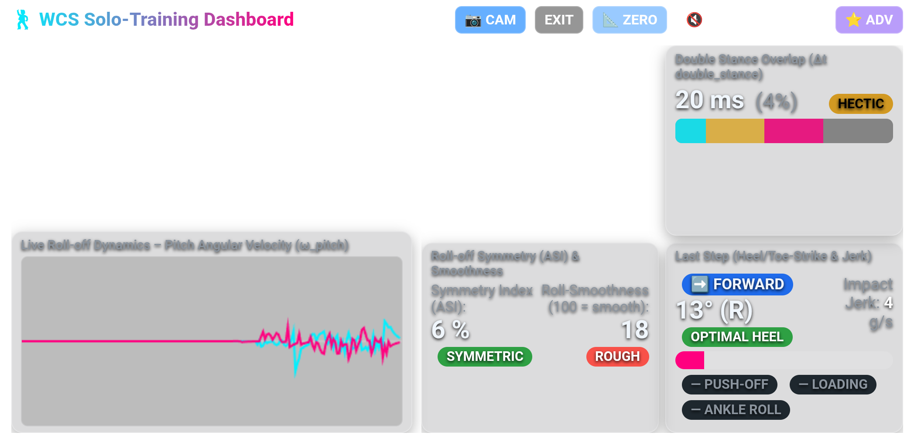
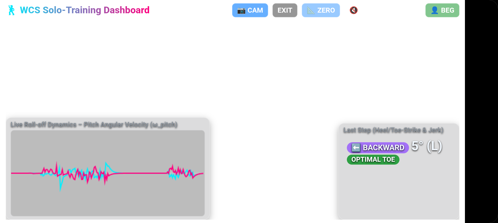
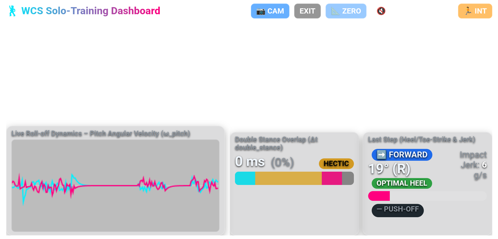

# WCS Solo-Training — Dancer's Guide

> This guide is written for dancers, not engineers. You do not need to understand the math.  
> Open the dashboard on your phone or tablet, follow the setup steps, and use the badge colour as your real-time coach.

---

## 1. Getting Started

1. **Mount your phone or tablet on a tripod** at eye level, facing you. Use **landscape orientation** for best results.
2. **Open the Solo Dashboard** in your browser (`http://192.168.4.1/solo` on the M5 hotspot, or the home WiFi IP shown on the M5 display).
3. **Tap `📷 CAM`** to activate the camera overlay. Your live body appears behind the data cards.
4. **Put on your dance shoes** before the next step.
5. **Stand in your natural dance stance** — feet shoulder-width, slight forward weight. Tap `📐 ZERO`. The system now knows what "flat foot on the floor" means for your shoes.
6. **Tap `🔊 Biofeedback: OFF`** to turn audio ON. The beeps fire faster than you can read the screen — they are your primary alert.
7. Start walking or dancing. Give yourself 10–15 steps to warm up before analysing anything.

> **Re-tare whenever you change shoes or surfaces.** The `📐 ZERO` calibration is shoe-specific.

---

## 2. The Dashboard Layout

<table><tr><td></td></tr></table>

In landscape mode the screen is divided into two columns:

```
┌─────────────────────────┬──────────────────┬──────────────────┐
│                         │  Pelvis –        │  Double Stance   │
│   📷  CAMERA            │  Hip Mechanics   │  Overlap         │
│   visible here          │  (if sensor on)  │                  │
├─────────────────────────├──────────────────┼──────────────────┤
│   Roll-off Dynamics     │  Roll-off        │  Last Step       │
│   Graph                 │  Symmetry (ASI)  │  (Step Badge)    │
└─────────────────────────┴──────────────────┴──────────────────┘
```

- **Top-left area**: shows the **Pelvis — Hip Mechanics** card when the pelvis sensor is clipped on and powered; otherwise empty so the camera shows through unobstructed.
- **Bottom-left**: live roll-off dynamics graph (pitch angular velocity of both feet over time).
- **Top-right**: Double Stance Overlap card.
- **Bottom-right**: Last Step card (your primary real-time feedback).
- **Bottom-centre**: Roll-off Symmetry & Smoothness card.

---

## 3. Choosing Your Training Level

The **`👤 BEG`** button in the top-right corner of the header cycles through three training levels. Tap it to switch; the selection is remembered between sessions.

| Button | Level | What is visible |
| :--- | :--- | :--- |
| `👤 BEG` (green) | **Beginner** | [Step Badge](#4-the-step-badge-card) card only — direction, angle, strike badge. [Pelvis card](#8-the-pelvis-card-optional-sensor) shows [Hip Activation](#hip-activation) if sensor is online. |
| `🏃 INT` (orange) | **Intermediate** | [Step Badge](#4-the-step-badge-card) (full, with [Jerk](#impact-jerk-bar) + [Push-Off](#push-off-badge-int--adv)) + [Double Stance](#6-the-double-stance-card). [Pelvis card](#8-the-pelvis-card-optional-sensor) adds [Slot Adherence](#slot-adherence-int), [Hip-Foot Coupling](#hip-foot-coupling-int), [Vertical Bounce](#vertical-bounce-int). |
| `⭐ ADV` (purple) | **Advanced** | All cards — [Step Badge](#4-the-step-badge-card), [Double Stance](#6-the-double-stance-card), [Roll-off Symmetry & Smoothness](#7-the-roll-off-symmetry--smoothness-card). [Pelvis card](#8-the-pelvis-card-optional-sensor) adds [Anchor Settle](#anchor-settle-adv). |

Cards that are not relevant for your level are hidden, giving the camera maximum screen space.

> **Note:** These levels describe the **complexity of feedback shown on screen** — they have nothing to do with your WSDC competition division. A Champion-level dancer starting a new drill should use `👤 BEG` to focus on one thing at a time. An absolute newcomer drilling something specific may benefit from switching to `🏃 INT`. Choose the level that matches what you are currently working on, not your competition résumé.

### Beginner view

<table><tr><td></td></tr></table>

One card, bottom-right. Everything else is camera. Look at the [direction badge](#how-direction-is-determined) and the [strike badge](#4-the-step-badge-card) after each step. Nothing else.

### Intermediate view

<table><tr><td></td></tr></table>

Two cards at the bottom. [Step technique](#4-the-step-badge-card) on the right, [timing quality (Double Stance)](#6-the-double-stance-card) on the left. The upper half of the screen remains camera.

### Advanced view

<table><tr><td></td></tr></table>

Three metric cards plus the live graph: [Step Badge](#4-the-step-badge-card), [Double Stance](#6-the-double-stance-card), and [Roll-off Symmetry & Smoothness](#7-the-roll-off-symmetry--smoothness-card). Use this level for detailed analysis sessions, not for learning new patterns.

---

## 4. The Step Badge Card

This is the **primary real-time feedback card**. It updates on every detected foot contact.

> **📸 SCREENSHOT:** *Step Badge card close-up showing: direction badge (e.g. ➡️ FORWARD), angle value, strike badge (e.g. OPTIMAL HEEL in green), Jerk bar, and the three lower badges (POWER PUSH / LOADING / ANKLE ROLL).*

### What the display elements mean

| Element | What it tells you |
| :--- | :--- |
| **➡️ FORWARD** / **⬅️ BACKWARD** | Direction of the step that just landed |
| **↔️ FLAT** | Foot landed too flat to classify — treat as a flat-foot warning |
| **θ angle** | Pitch of your foot at landing. Positive = heel higher than toe. |
| **Strike badge** (large coloured label) | Classification of that landing — see tables below |
| **Jerk bar** | Rate of impact force — how hard your foot hit the floor |
| **PUSH-OFF badge** | Push-off power of your trailing foot (Beginner: hidden) |
| **LOADING badge** | How smoothly you transferred weight onto the landing foot (Advanced only) |
| **ANKLE ROLL badge** | Ankle shock absorption at landing (Advanced only) |

### How direction is determined

The system classifies direction from foot pitch angle θ. Direction is **reliable only at the extremes**:

| Direction badge | θ at landing | Meaning |
| :--- | :--- | :--- |
| **➡️ FORWARD** | θ ≥ +10° | Clear dorsiflexion — heel contacted first |
| **↔️ FLAT** | −5° to +9° | Ambiguous zone — foot too flat to classify direction |
| **⬅️ BACKWARD** | θ < −5° | Clear plantarflexion — toe-ball contacted first |

A single foot IMU cannot separate a flat forward step from a backward step with an early heel drop when θ is between −5° and +9°. Both show ↔️ FLAT.

### Forward step badges (➡️ FORWARD, θ ≥ +10°)

| Badge | Angle | What you did | Target |
| :--- | :--- | :--- | :--- |
| `HEEL SPIKE` ⚠️ | > +35° | Extremely steep heel angle | Reduce drive force or relax the ankle |
| `OPTIMAL HEEL` ✅ | +10° to +35° | Clean heel strike — heel contacts first | Target for all forward walks and breaks |
| `BRUSH+HEEL` ✅ | flat → +8° heel within 200 ms | Ball brushed during swing, then heel set cleanly | Reclassified from FLAT-FOOT! when the sensor detects the two-phase contact |

### Ambiguous zone (↔️ FLAT, −5° to +9°)

| Badge | Condition | What it means |
| :--- | :--- | :--- |
| `FLAT-FOOT!` ❌ | flat landing, no follow-through | Could be: forward step with insufficient heel lift, OR backward step with heel dropping too early. Use camera to check actual direction. |
| `BRUSH+HEEL` ✅ | flat → heel-set detected within 200 ms | System auto-reclassifies — correct forward technique confirmed |

### Backward step badges (⬅️ BACKWARD, θ < −5°)

| Badge | Angle | What you did | Target |
| :--- | :--- | :--- | :--- |
| `OPTIMAL TOE` ✅ | −5° to −20° | Clean toe-ball contact | Target for all backward walks, anchors, extensions |
| `HEEL SPIKE` ⚠️ | < −20° | Over-pointed foot at contact | Moderate the extension slightly |

> **Note on backward HEEL errors:** A backward step where the heel drops early (θ = +5° to +9°) or strikes first (θ ≥ +10°) will show ↔️ FLAT or ➡️ FORWARD — the sensor cannot confirm backward direction in those ranges. If you see consistent FLAT-FOOT! on what you believe are backward steps, your heel is most likely contacting too early. Focus on sending the toe out first and keeping the ankle dorsiflexed until the foot settles.

### Impact Jerk bar

- **Short bar, no click** → soft, controlled landing. Ideal.
- **Full red bar + 500 Hz click** → heavy stomping. Bend the knee on contact and absorb with the ankle.

---

## 5. Push-Off & Loading Badges

These three badges appear below the Jerk bar and update after each step. Visible from **Intermediate** level (Push-Off) or **Advanced** (Loading + Ankle Roll).

> **📸 SCREENSHOT:** *Step Badge card bottom section showing all three badges lit: 🚀 POWER PUSH (green), SMOOTH LOAD (green), ANKLE FLEX (green).*

### Push-Off badge (INT + ADV)

| Badge | What it means | How to improve |
| :--- | :--- | :--- |
| `🚀 POWER PUSH` ✅ | Strong push-off from the trailing foot — optimal for both forward propulsion and anchor redistribution | Maintain — the system adjusts its target automatically: higher threshold for forward walks, lower for anchors and backward steps |
| `↗ PUSH` ⚠️ | Push-off detected but below the directional target | Drive more actively through the ball of the trailing foot; think "push the floor away" |
| `— PUSH-OFF` | No significant push-off detected | Trailing leg is passive. Actively extend the ankle at the end of each walk |

### Loading badge (ADV only)

| Badge | What it means | How to improve |
| :--- | :--- | :--- |
| `SMOOTH LOAD` ✅ | Weight transferred progressively onto the landing foot | Good joint mechanics — keep it |
| `INSTANT LOAD` ⚠️ | Full weight dropped at impact | Slow the COM; think of "receiving" the floor rather than landing on it |
| `EARLY UNLOAD` ⚠️ | Weight shifting away before foot is settled | You are rushing to the next step. Complete the current weight investment before moving |

### Ankle Roll badge (ADV only)
| Badge | What it means | How to improve |
| :--- | :--- | :--- |
| `RIGID LEVER` ✅ | Full pronation → supination cycle detected: ankle absorbed the impact AND locked up for push-off | Optimal ankle mechanics — maintain |
| `ANKLE FLEX` ✅ | Ankle rolling through impact (pronation impulse detected) | Good shock absorption — ankle acting as natural spring |
| `MODERATE ROLL` ⚠️ | Some ankle mobility, but could be more | Consciously relax the ankle at landing; avoid bracing the foot rigid |
| `STIFF ANKLE` ⚠️ | Minimal ankle roll — impact transmitted directly up the chain | Land with a soft, unlocked ankle. Over time this reduces knee and hip load |

---

## 6. The Double Stance Card

Visible from **Intermediate** level. This card tells you how long both feet are on the floor simultaneously during each weight transfer.

> **📸 SCREENSHOT:** *Double Stance card showing the timeline bar (cyan left section, yellow overlap section, magenta right section) and the OPTIMAL ROLL badge.*

| Badge | Overlap ratio | What it means | Training implication |
| :--- | :--- | :--- | :--- |
| `OPTIMAL ROLL` ✅ | 18%–38% | Smooth, grounded weight transfer | The characteristic WCS rolling connection |
| `HECTIC` ⚠️ | < 18% | Rushed — one foot leaves before the other is secure | "Peel, don't lift" — roll through the foot before stepping |
| `SLUGGISH` ⚠️ | > 38% | Prolonged double contact — hesitation or heavy stance | Commit to the COM shift earlier |

Watch this card during **triple steps and walks**. `HECTIC` on an anchor step often means you are rushing out of the anchor before building connection.

---

## 7. The Roll-off Symmetry & Smoothness Card

Visible at **Advanced** level only.

> **📸 SCREENSHOT:** *ASI card showing ASI value, SYMMETRIC badge, Smoothness value, and SMOOTH badge.*

| Display | What it tells you | Green target |
| :--- | :--- | :--- |
| **ASI %** | Difference between left and right foot roll-off | `SYMMETRIC` — below 10% |
| **Smoothness** | Fluidity of ankle articulation across both feet | `SMOOTH` — 65 or above |

- High **ASI** (e.g. `ASYMMETRIC` > 25%) usually means one ankle is stiffer, or one side is compensating for an old injury.
- Low **Smoothness** means your ankle movements are jerky. Slow the tempo and focus on rolling through the full foot rather than stepping flat.

---

## 8. The Pelvis Card (Optional Sensor)

The pelvis card appears in the **top-left slot** of the dashboard whenever the pelvis sensor is powered on. When the sensor is offline, that slot remains empty and the camera shows through.

### Mounting the sensor

Clip the sensor to the **posterior waistband at the small of your back** (L5 / sacrum level), display facing away from your body. Centred on the spine is ideal, but left or right of centre by a few centimetres makes no practical difference. It should sit flat and snug — not dangling.

### Badge overview

| Badge row | Level | What is measured |
| :--- | :--- | :--- |
| **Hip Activation** | BEG+ | How much the pelvis is rotating during movement (yaw) |
| **Slot Adherence** | INT+ | Lateral drift of the pelvis away from the slot line |
| **Hip-Foot Coupling** | INT+ | Whether hips initiate each step or follow the feet |
| **Vertical Bounce** | INT+ | How much vertical movement the pelvis generates |
| **Anchor Settle** | ADV | Quality of the pelvis settle in the 500 ms after each anchor step |

---

### Hip Activation

Measures peak transverse hip rotation (yaw rate) over a rolling 500 ms window.

| Badge | What it means | How to improve |
| :--- | :--- | :--- |
| `🌀 ACTIVE` ✅ | Strong hip rotation contributing to the movement | Maintain |
| `MODERATE` ⚠️ | Some rotation but hip contribution is limited | Wind the hip up before each step — rotation should start in the pelvis, not the ankle |
| `STIFF HIPS` ❌ | Pelvis barely rotating — movement driven by legs only | Drill isolated hip rotations first, then add feet. "Lead with the hip, not the heel." |

> In WCS, hip rotation should accompany or precede each step. `STIFF HIPS` is one of the most common beginner patterns and is invisible to foot sensors alone.

---

### Slot Adherence (INT+)

Measures lateral acceleration variance of the pelvis over 1 second. WCS movement is linear — the pelvis should travel forward and backward along the slot, not drift sideways.

| Badge | What it means | How to improve |
| :--- | :--- | :--- |
| `IN SLOT` ✅ | Pelvis tracking cleanly along the slot line | Good |
| `SLIGHT DRIFT` ⚠️ | Minor lateral movement — common on turns or triple steps | Focus on keeping the hips facing parallel to the slot on straight walks |
| `OUT OF SLOT` ❌ | Significant lateral deviation | Check for hip hike, side-stepping, or off-slot footwork |

---

### Hip-Foot Coupling (INT+)

Compares when peak hip rotation occurred relative to the moment of foot contact. In good technique the hips initiate the movement before the foot lands.

| Badge | What it means | How to improve |
| :--- | :--- | :--- |
| `HIP LEADS` ✅ | Peak hip rotation occurred more than 100 ms before foot contact | Good initiation — hips are driving the step |
| `IN SYNC` ⚠️ | Hip peak and foot contact within 40–100 ms of each other | Acceptable — try amplifying the pre-step hip "launch" |
| `HIP LAGS` ❌ | Hips rotating at or after foot contact | Legs are moving independently of the core. Slow down and practise initiating each walk from the hip, letting the foot follow |

---

### Vertical Bounce (INT+)

Measures the variance of vertical pelvis acceleration (gravity removed) over 1 second. WCS movement is horizontal — the pelvis COM should track at a stable height.

| Badge | What it means | How to improve |
| :--- | :--- | :--- |
| `GROUNDED` ✅ | Minimal vertical movement | Good |
| `SLIGHT BOUNCE` ⚠️ | Some vertical oscillation | Maintain a light bend in the knees throughout; avoid extending to a straight leg during travel |
| `BOUNCY` ❌ | Significant up-down movement | Stay in your knees. Think: "stay low, stay connected." |

---

### Anchor Settle (ADV)

After every backward (anchor) step, the system opens a 500 ms measurement window and evaluates three signals from the pelvis:

1. **Deceleration** — did the pelvis slow down in the anterior-posterior direction? A quality anchor redirects momentum rather than collapsing.
2. **Yaw damping** — did hip rotation slow after the step? A settled anchor shows the pelvis "parking" over the feet.
3. **Stability** — how still was the pelvis in the second half of the window? High stability = you held the position without wobbling.

These three components are combined into a 0–100 score displayed in the badge.

| Badge | Score | What it means | How to improve |
| :--- | :--- | :--- | :--- |
| `ANCHORED (n)` ✅ | ≥ 60 | Strong deceleration + yaw damping + stable hold | Good — work on consistency across every anchor step |
| `SETTLING (n)` ⚠️ | 30–59 | Partial settle — one or two components weak | Identify the weak component using the tips below |
| `UNSTABLE (n)` ❌ | < 30 | Pelvis still moving or wobbling after the anchor | Focus on "sticking" the anchor — reach the end of the slot and hold |

**Diagnosing a low score:**
- **Low score despite clean foot technique** → the issue is pelvis, not foot angle. The pelvis is still rotating or drifting after the foot plants. Work on the settle itself, not the step.
- **`HECTIC` Double Stance + low Anchor Settle** → you are leaving the anchor before the pelvis has stabilised. Let the pelvis settle before initiating the next move.
- **`🌀 ACTIVE` hip + `UNSTABLE` anchor** → hips rotate well during travel but do not dampen at the anchor. Practise a deliberate "soft stop": active hips during the walk, clear rotation-off at the anchor.

---

## 9. Training by Skill Level

### Beginner — use `👤 BEG`

**One focus: heel vs. toe contact.**

1. Walk forward. Does the badge say `OPTIMAL HEEL`? If not — lift your heel slightly more before the foot lands.
2. Walk backward. Does the badge say `OPTIMAL TOE`? If not — send your toe out first, like a probe, before the body weight follows. If you see ↔️ FLAT + `FLAT-FOOT!` on backward steps, your heel is contacting the floor before the toe.
3. If you hear the **1200 Hz beep**, stop and slow down. That is a hard `FLAT-FOOT!` impact.
4. Practise at a slow tempo until `OPTIMAL HEEL` and `OPTIMAL TOE` appear consistently. Only then increase speed.

**With pelvis sensor:** Watch **Hip Activation** only. If `STIFF HIPS` appears consistently, your legs are moving without your core engaging. Slow right down and feel the hip rotation before each step.

> **How to read the screen:** After each step, glance at the bottom-right card. The large coloured badge is the verdict. Green = correct. Red/yellow = adjust.

### Intermediate — use `🏃 INT`

**Two focuses: technique consistency + weight transfer timing.**

1. Forward walks → aim for consistent `OPTIMAL HEEL` with the Jerk bar under half.
2. Backward walks → aim for `OPTIMAL TOE`. The direction badge ⬅️ BACKWARD confirms good toe-first technique. ↔️ FLAT on a backward step means the foot is landing too flat — check the camera to confirm whether it is a heel drop or a genuine flat landing.
3. Watch the **POWER PUSH badge**: is your trailing leg passive? Drive through the ball of the foot at the end of each walk.
4. Introduce the **Double Stance card**: work toward `OPTIMAL ROLL` during triple steps. `HECTIC` during the anchor means you are rushing.

**With pelvis sensor:** Add **Slot Adherence**, **Hip-Foot Coupling**, and **Vertical Bounce** to your checklist. The single most valuable metric at this level is Hip-Foot Coupling — consistent `HIP LAGS` means you are walking with your feet, not your body.

### Advanced — use `⭐ ADV`

**Full biomechanical feedback loop.**

1. Use **SMOOTH LOAD vs INSTANT LOAD** to fine-tune how you receive weight — especially on syncopated patterns where COM timing is critical.
2. Compare **ASI** between your left and right sides over a full practice session. A consistently worse side points to a compensation pattern worth isolating.
3. Use **ANKLE FLEX vs STIFF ANKLE** to monitor fatigue — ankle stiffness increases as muscles tire. This is a natural cue to take a break.
4. Film with `📷 CAM` and replay during pauses. Watch for steps where ↔️ FLAT fires on what you believe is a clear forward or backward step — your body position at that moment usually reveals insufficient ankle articulation during the swing phase.
5. Use the **Roll-off Dynamics graph** (bottom-left) to compare peak gyro values between your left and right foot over multiple steps — uneven peaks indicate asymmetric push-off.

**With pelvis sensor:** Focus on **Anchor Settle** as your anchor quality KPI. Run a full 8-count basic and check the score after each anchor step. A score below 60 consistently means either the pelvis is still rotating at the anchor (fix: `HIP LEADS` on the way in, deliberate damping on arrival) or it is not decelerating cleanly (fix: actively resist at the end of the slot rather than letting momentum stop you).

---

## 10. Common Problems and How to Fix Them

| What you see | Root cause | Fix |
| :--- | :--- | :--- |
| `FLAT-FOOT!` on every forward walk | Ankle held rigid; no heel articulation | Slow down. Exaggerate heel-first contact consciously. Drill: walk in place, touching heel then ball in sequence. |
| `FLAT-FOOT!` + ↔️ FLAT on backward steps | Heel contacting before toe during backward walk | Sensor cannot show ⬅️ BACKWARD when θ ≥ −5°. If camera confirms you are moving backward, your heel is landing too early — send the toe first, keep the ankle dorsiflexed until the foot settles. |
| `HECTIC` Double Stance | Rushing the transfer; foot lifts too early | "Leave the floor last" — let the whole foot peel up from the toe. |
| `SLUGGISH` Double Stance | Hesitating before committing weight | Trust the floor. Move the body, not just the foot. Drill: metronome walks, landing on the beat. |
| `STIFF ANKLE` consistently | Braced ankle at landing | Visualise landing on a sponge. Consciously unlock the ankle before contact. |
| `ASYMMETRIC` ASI | One foot stiffer or less articulated | Identify which foot and drill that foot in isolation with slow, deliberate rolls. |
| `— PUSH-OFF` (no badge) | Trailing leg passive — no ankle drive | "Push the floor, don't just lift the foot." Add a conscious toe-extension at the end of each walk. |
| `INSTANT LOAD` on anchors | Dropping weight abruptly at anchor | Slow the settle. "Melt into the anchor" rather than "land on it". |
| `↗ PUSH` but never `🚀 POWER PUSH` on walks | Forward drive below 200°/s push-off threshold | Increase hip extension range and actively drive the ball of the trailing foot into the floor. Think longer stride, not harder stomp. |
| `↗ PUSH` but never `🚀 POWER PUSH` on anchors | Anchor redistribution below 160°/s threshold | The settle itself is passive — actively push the floor away as you redistribute weight at the end of the anchor. |
| `STIFF HIPS` constantly | Legs moving without core engagement | Start each step with a deliberate hip rotation impulse before the foot moves. Drill in place: rotate hip, then step. |
| `OUT OF SLOT` on walks | Hip hike or lateral stepping | Keep hips facing parallel to the slot; check that footwork stays on the line and avoid shifting weight sideways. |
| `HIP LAGS` on every step | Legs and core disconnected — feet moving independently | Slow to a very slow tempo. Stand still, initiate a hip rotation, then let the foot follow. The hip must move first. |
| `BOUNCY` continuously | Knee extension during travel — "posting" on a straight leg | Stay in a slight knee bend throughout the walk. The height of your head should not change between steps. |
| `UNSTABLE` anchor always | Pelvis still rotating or drifting after the anchor step | Practise the anchor in isolation: step back, plant both feet, and consciously stop all hip movement. Hold for two counts before moving again. |
