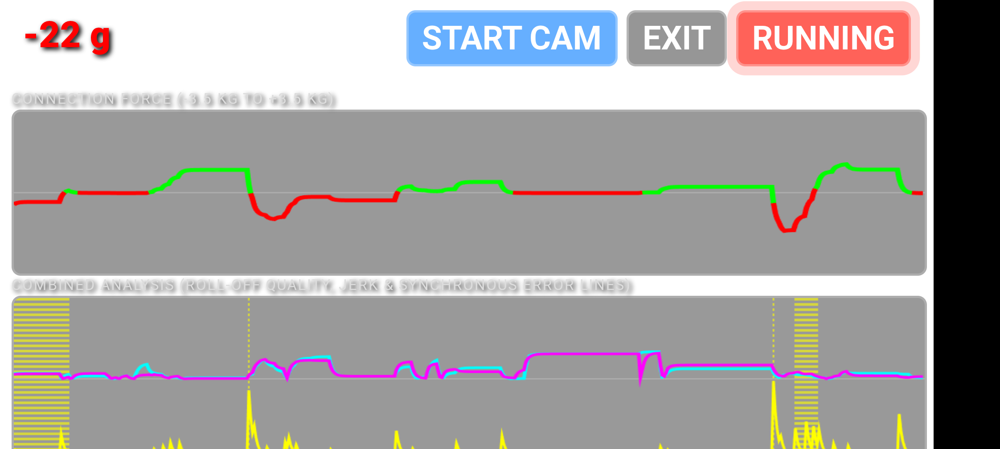

# 🕺 WCS Movement and Connection Analysis System

A real-time wireless sensor network and video-overlay feedback system built for **West Coast Swing (WCS)** dancers and coaches. Sensors stream live biomechanical data to a web dashboard that overlays directly on the phone camera — giving instant physical telemetry while you dance.

> 🇩🇪 **Deutsche Dokumentation:** [Documentation_german/README.md](Documentation_german/README.md)



---

## What It Measures

| Sensor | Measures |
| :--- | :--- |
| **Left & Right Foot** | Foot roll-off quality (gyro angular rate), heel/toe strike angle, impact force (Z-axis g-force), push-off power |
| **Hand / Scale Unit** | Lead-follow tension in grams (−3.5 kg to +3.5 kg via HX711 strain gauge), connection jerk index |
| **Pelvis Sensor** *(optional)* | Lateral pelvic tilt, yaw damping (Anchor Settle score), hip activation (yaw rate), hip–foot coupling timing, vertical bounce |

Alerts fire immediately as audio beeps and coloured badge overlays — faster than you can read a graph.

---

## Two Dashboards

### Main Dashboard — Connection & Footwork Overview
Real-time canvas graphs for both feet and the hand sensor. Designed for coaches observing from the side. Open in any browser at the Master's IP address root (`/`).

### Solo Training Dashboard — Foot Articulation Deep-Dive
Detailed step-by-step badge feedback for solo drills. Designed for the dancer to glance at between steps. Open at `/solo`.

Three training levels hide or reveal cards depending on what is relevant:

| Level | What is shown | Who it is for |
| :--- | :--- | :--- |
| `👤 BEG` | Step direction + heel/toe badge only | Learning basic foot contact |
| `🏃 INT` | + Jerk bar, Push-Off badge, Double Stance card | Technique refinement |
| `⭐ ADV` | All cards — full biomechanical feedback incl. pelvis metrics | Detailed analysis |

When the optional **Pelvis Sensor** is attached, both dashboards display five additional real-time metrics: hip activation, lateral stability, hip–foot coupling, vertical bounce, and Anchor Settle score.

---

## Documentation

| Document | Audience | Contents |
| :--- | :--- | :--- |
| [**Dancer's Guide — Solo**](Documentation_english/dancer_guide_solo.md) | Dancers | How to use the Solo Dashboard: setup, level selector, all badge cards, training progressions, common problems. Start here if you want to train — no technical knowledge required. |
| [**Dancer's Guide — Partner**](Documentation_english/dancer_guide_partner.md) | Coaches / Partners | How to use the Partner Dashboard: connection force graph, combined analysis graph, pelvis badges, coaching use cases. Open on a second device while the dancer uses the solo view. |
| [**Solo Dashboard — Technical Reference**](Documentation_english/solo_explanations.md) | Coaches / Developers | Architecture, sensor math, complementary filter, step detection algorithm, all metric formulas, threshold tables, firmware notes. |
| [**Connection Dashboard — Technical Reference**](Documentation_english/explanations.md) | Developers / Nerds | Connection force, jerk formula, foot roll-off quality, threshold derivations, visualization architecture. |
| [**Parts List**](Documentation_english/parts.md) | Builders | Bill of materials, wiring, and sourcing notes for building the hardware. |

---

## Quick Start

### First-time setup
1. **Flash the firmware** — see [Firmware Flashing](#firmware-flashing) below.
2. Create `secrets.h` with your Wi-Fi credentials (optional — without it the Master runs as a standalone access point).

### Every session
1. **Power on the Master Unit** first — it locks the Wi-Fi channel.
2. **Power on the Foot Sensors** (and Hand Unit and Pelvis Sensor if using). They scan channels 1–13 and auto-pair with the Master.
3. **Connect your phone or tablet** to the Master's Wi-Fi network (`M5-Dance-Master` / `12345678`, or your home Wi-Fi if configured).
4. **Open the dashboard** in your browser:
   - Main dashboard: `http://<IP>/`
   - Solo dashboard: `http://<IP>/solo`
5. **Tap `📷 CAM`** to show your live camera behind the data cards.
6. **Tap `📐 ZERO`** while standing naturally in your dance stance to calibrate the foot angle baseline.
7. **Tap `🔊 Biofeedback: OFF`** to enable audio alerts.

> The IP address is shown on the Master's display on startup. In AP-only mode it is always `192.168.4.1`.

---

## System Architecture

```text
                   +-------------------------+
                   |   Foot Sensor (Left)    |
                   | ID: 1 | M5Stack + IMU   |
                   +------------+------------+
                                |
                                | ESP-NOW Broadcast / Channel Auto-Sync
                                v
+------------------------+  +---+--------------------+  +-------------------------+
|   Hand / Scale Unit    |->|   Central Master Unit  |<-|   Foot Sensor (Right)   |
| ID: 3 | HX711 + IMU   |  |    M5Stack Master      |  | ID: 2 | M5Stack + IMU   |
+------------------------+  +----------+-------------+  +-------------------------+
 +-------------------------+           |
 | Pelvis Sensor (opt.)    |..........>| (ESP-NOW, same channel)
 | ID: 4 | M5Stack + IMU   |           |
 +-------------------------+           | Wi-Fi AP/STA + WebServer (port 80)
                                       v
                           +-----------+-------------+
                           |   Web Dashboard (HTML5) |
                           |  /      Main dashboard  |
                           |  /solo  Solo dashboard  |
                           |  /data  JSON endpoint   |
                           +-------------------------+
```

### Data flow
- Foot, Hand, and Pelvis sensors broadcast IMU/scale packets via **ESP-NOW** at 200 Hz.
- Master receives packets, aggregates them, and exposes a `/data` JSON endpoint.
- Dashboard polls `/data` at 50 Hz and renders badges, graphs, and camera overlay in the browser.

---

## Hardware Requirements

| Unit | Hardware |
| :--- | :--- |
| Master | M5StickC Plus / Plus2 or M5Stack Core |
| Foot Sensors (×2) | M5StickC Plus / Plus2 (internal 6-axis IMU required) |
| Hand / Scale Unit | M5StickC + HX711 load cell amplifier + strain-gauge load cell (GPIO 33 DOUT / GPIO 32 SCK) |
| Pelvis Sensor *(optional)* | M5StickC Plus / Plus2 (internal 6-axis IMU required) — worn on a belt at the sacrum |

Full bill of materials and wiring: [parts.md](Documentation_english/parts.md)

---

## Software Requirements

Install the following libraries in **Arduino IDE** or **PlatformIO**:

- `M5Unified`
- `WiFi.h` / `esp_wifi.h`
- `esp_now.h`
- `WebServer.h`
- `HX711.h`

---

## Firmware Flashing

1. **Master Unit**
   - Optionally create `M5ControllerServer/src/secrets.h` with your Wi-Fi credentials:
     ```cpp
     #define STAMMI_SSID "YourNetworkName"
     #define STAMMI_PASS "YourPassword"
     ```
   - Without `secrets.h` the Master runs as a standalone access point (`192.168.4.1`).
   - Flash `M5ControllerServer/`.

2. **Foot Sensors**
   - Flash `M5Left/` — `#define FOOT_ID 1` (Left foot, physically mounted with aY axis inverted).
   - Flash `M5Right/` — `#define FOOT_ID 2` (Right foot, standard mounting).

3. **Hand / Scale Unit**
   - Flash with `#define HAND_ID 3`.
   - Default scale factor: `129.1f` — calibrate against a known weight if needed.

4. **Pelvis Sensor** *(optional)*
   - Flash `M5Pelvic/` — `#define PELVIS_ID 4`.
   - Mount on a belt at the sacrum with the display facing outward.

---

## Open Items

- Improve the physical grip/handle on the hand scale unit.

Suggestions and ideas welcome.
